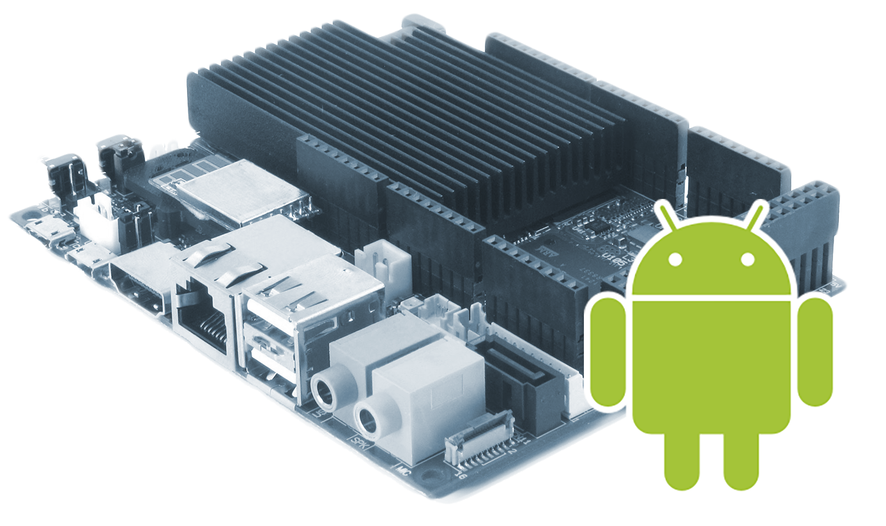

Title: Hacking Android on the UDOO board for SATA and S/PDIF
Date: 2015-04-03
Tags: electronics
      android
Icon: index.png
Abstract: How to build and flash a custom Android image for the UDOO Quad board. Hacking the UDOO kernel config and Android prop files to enable SATA hard-drive support and S/PDIF digital audio.

I recently came in possession of a [UDOO Quad board](http://www.udoo.org/).
For the ones who never heard about this, it is essentially a kind of quad-pumped Raspberry PI with some nice extras (a SATA port, an extra Atmel MCU, Ethernet, USB OTG).
The board is based on a [Freescale i.MX6Q](http://www.freescale.com/webapp/sps/site/prod_summary.jsp?code=i.MX6Q) SoC, a Quad-core Cortex® A9.  
The hardware onboard is pretty powerful compared to many other competitor boards.
Unfortunately, however, the software support for Android is lagging a bit.
In particular, in the latest image shipped by UDOO (Android JB 4.3 v2.0.2) both the SATA port and the S/PDIF digital audio output are not functional.

For this reason I spent some time working on a fork of the image and patched both the Kernel and the Android framework to fix it.
All the work described here is based on the Android 4.3 Sources v2.0 (U-Boot, Kernel, File System) from [udoo.org](http://www.udoo.org) and is open-source, maintained in [my GitHub account](https://github.com/primiano).

### Improvements in this Image

 * Patched kernel support for S/PDIF
 * Enabled kernel support for SATA
 * Fixed initrc to deal with SATA HDD
 * Changed fstab.freescale to mount /data on /dev/sda1

Download SD image
-----------------
SD card (2GB) image:
[{.inline}udoo-android-4.3-v2.0-with-sata-img.zip](https://github.com/primiano/udoo_platform_manifest/releases/download/udoo-sata/udoo-android-4.3-v2.0-with-sata-img.zip)

A 2 Gb SD card will suffice (/data is on the HDD). You should unzip and flash the image on the SD card as usual:

    dd if=sdcard.img of=/dev/sdX bs=1M conv=fsync

The image has been built off my [udoo-android-4.3-v2.0-with-sata](https://github.com/primiano/udoo_platform_manifest/tree/udoo-android-4.3-v2.0-with-sata) branch.

Prepare the SATA HDD
--------------------
The image requires **both a SD card and a SATA HDD**.  
All the partitions (/boot, /system, /cache, ...) are mounted from the SD card as in the original image. The /data partition (the place where Android keeps downloaded apps, settings, downloads, music etc.), instead, is mounted from the SATA HDD.  
In my opinion keeping the base system image on the SD card makes the hacking / development cycle easier, allowing to test a new kernel or Android base image by just swapping in another SD card.

The partition layout is defined in [device/fsl/udoo/fstab.freescale](https://github.com/primiano/udoo_device_fsl/blob/2200adca96072d216132e5cf06504be7dd16976a/udoo/fstab.freescale)  
You can prepare your HDD on a Linux machine as follows:

    # sdX is the name of the HDD you will attach to the board
    sudo cfdisk /dev/sdX
    # Create only one Linux partition which covers the entire HDD
    sudo mkfs.ext4 /dev/sdX1

Building from sources
---------------------
Here are some instructions if you want to get in hardcore Kernel / Android hacking.

I maintain a fork of the Android JB 4.3 Android image on GitHub:  
[https://github.com/primiano/udoo_platform_manifest](https://github.com/primiano/udoo_platform_manifest)

The following branches are available:

 * *udoo-android-4.3-v2.0* : the original image (some irrelevant projects stripped, see notes below).
 * *udoo-android-4.3-spdif* : as above + changes for S/PDIF output.
 * *udoo-android-4.3-v2.0-with-sata* : as above + SATA suport (needs a partition on the HDD)
 * *master* : Bleeding edge / experimental.

I suggest reading my previous article [HowTo: Fork Android on GitHub](/blog/fork-android-on-github) to get an overall background about the development workflow / forking process.

**Prepare the system**

    :::bash
    sudo apt-get install git gnupg flex bison gperf build-essential zip curl \
      libc6-dev libncurses-dev x11proto-core-dev libreadline-dev g++-multilib \
      mingw32 tofrodos python-markdown libxml2-utils xsltproc zlib1g-dev \
      libc6-i386 lib32stdc++6 lib32gcc1 lib32ncurses5 lib32z1 ia32-libs \
      file psmisc uuid-dev liblzo2-dev libswitch-perl

    git config --global user.name "My Name"
    git config --global user.email "my@email.com"  # These are required to repo sync

**Install Oracle Java 6 SDK**  
Oracle's Java 6 SDK is required to build Android. You need this version (it doesn't have to be the default, though).
Don't try to install other versions or use OpenJDK. It will not work (at least, not with Android 4.3).

 Download [jdk-6u45-linux-x64.bin from the Oracle website](http://www.oracle.com/technetwork/java/javase/downloads/java-archive-downloads-javase6-419409.html#jdk-6u45-oth-JPR)

    :::bash
    chmod +x jdk-6u45-linux-x64.bin
    ./jdk-6u45-linux-x64.bin
    sudo chown root. -R jdk1.6.0_45
    sudo mv jdk1.6.0_45 /usr/lib/jvm/java-6-sun
    export JAVA_HOME=/usr/lib/jvm/java-6-sun
    export ANDROID_JAVA_HOME=$JAVA_HOME

**Download git-repo**

    :::bash
    curl https://storage.googleapis.com/git-repo-downloads/repo > /tmp/repo
    sudo cp /tmp/repo /usr/local/bin/repo
    sudo chmod 755 /usr/local/bin/repo

**Sync the Android repo**

    :::bash
    mkdir udoo && cd udoo
    repo init -u https://github.com/primiano/udoo_platform_manifest
    repo sync -c -j4  # -j20 if your internet connection is *really* fast.

**Set up the build environment**

    :::bash
    export ARCH=arm
    export CROSS_COMPILE=$PWD/prebuilts/gcc/linux-x86/arm/arm-eabi-4.6/bin/arm-eabi-
    export PATH=$PWD/bootable/bootloader/uboot-imx/tools:$PATH
    source build/envsetup.sh
    lunch udoo-eng

**Build**

    :::Bash
    # Build the bootloader first
    pushd .
    cd bootable/bootloader/uboot-imx
    ./compile.sh
    popd

    # Then the Android image
    make -j8 droid    

**Flash the entire image**

    :::bash
    # Find out the device for the sdcard with lsblk, e.g., /dev/sdc
    sudo OUT=$OUT ./make_sd.sh /dev/sdX

**Building only the kernel**  
The kernel sources live in the kernel_imx/ folder.
The kernel is typically build as part as the Android image (the *droid* target). However, if you want to test kernel-only changes, you might want to save time regenerating and re-flashing only the $OUT/boot.img).  
Remember that the Android build steps will overwrite the .config file with the contents of [arch/arm/configs/imx6_udoo_android_defconfig](https://github.com/primiano/udoo_kernel_imx/blob/udoo-android-4.3-v2.0/arch/arm/configs/imx6_udoo_android_defconfig).

    :::bash
    make -C kernel_imx menuconfig
    cp .config arch/arm/configs/imx6_udoo_android_defconfig
    make bootimage -j4
    dd if=$OUT/boot.img of=/dev/sdX1 bs=4096 conv=fsync
