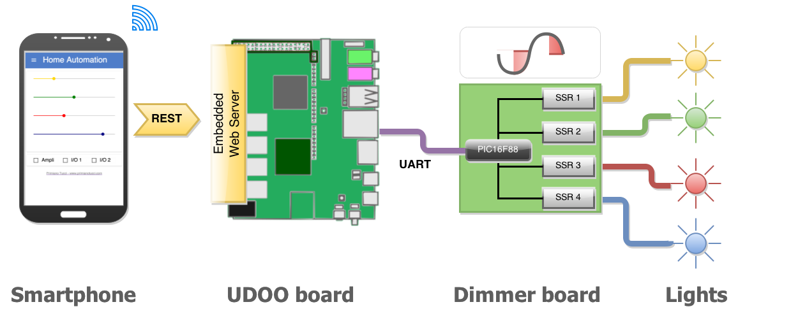
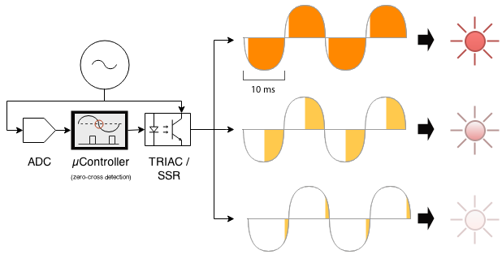
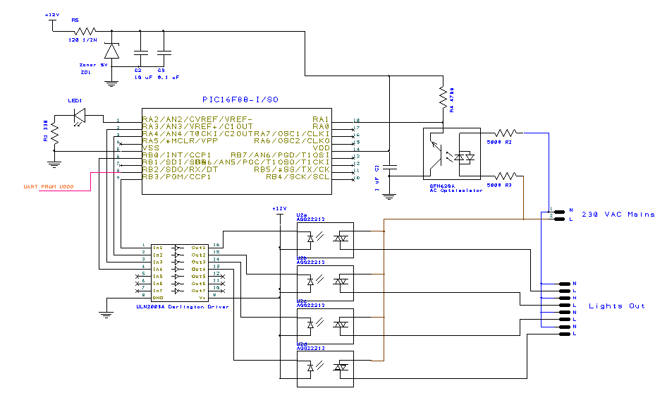
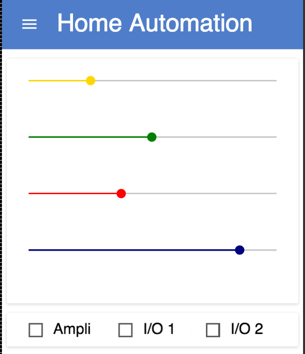

Title: DIY Home Automation in the IoT era with UDOO and Polymer
Date: 2015-02-14
Icon: index.png
Tags: electronics
      coding
Abstract: From real-time bit banging on TRIACs to HTML material design. Using remote lighting as a case study, this post proposes a full dive into all the layers involved in a modern IoT application, based on a PIC micro, a UDOO board, Android and Polymer HTML5 components.

Today is a very happy day for my control freakness.
I managed to complete a DIY project I had in mind for a while and today
I am going to share it with you, in full details.

This post is full of technical content (and source code) and covers many layers, which space from **real-time bit banging** on TRIACs to **material design**.
Using remote lighting as a case study, let's go for a full dive into all the layers involved in a modern IoT application, based on a PIC micro, a **UDOO board**, Android and **Polymer** components.

A short teaser video first [[youtu.be/x9J6h4_e5PA](https://youtu.be/x9J6h4_e5PA)]:
<iframe src="https://www.youtube.com/embed/x9J6h4_e5PA" style="width:95%; height: 30em;" class="shadowed" allowfullscreen></iframe>

This article is going to describe all the steps involved in the creation of a
web-based light dimmer:

- starting from very **low level electronics**: TRIACs, SSRs and dimmers
- going up to the **micro-controller firmware** to handle real-time smoothing of the
  mains waveform
- going to up to a simple **RESTful embedded web-server** on
  Linux/Android
- going up to a modern and nice looking **HTML UI** based on
   [Polymer](https://www.polymer-project.org)

'cause I am an extreme DIYer, and buying gadgets is for wimps.

Buzzwords for this article (people tend to like them a lot, I'm too lazy to wire them up properly): *connected revolution,
internet-of-things, web-of-things, things-of-things*.

Overall architecture
--------------------
The lighting controller consists of the following:

 - A PIC16F88 micro-controller, which handles the low-level light dimming /
   mains switching operations and drives the lights (AC bulbs).  
   [Link to the sources and schematics](https://github.com/primiano/light-dimmer)
 - An embedded web server, running on a [UDOO Quad board](http://www.udoo.org/).
   The server exposes a REST endpoint to control the lights and communicates
   with the PIC through one of the UDOO's UART ports.  
   [Link to the sources](https://github.com/primiano/udoo_packages_apps_home_automation)
 - A HTML5 web-app, based on [Polymer](https://www.polymer-project.org),
   to handle the user-interface.  
   [Link to the sources](https://github.com/primiano/udoo_packages_apps_home_automation/tree/master/html/components/home-automation)

Safety warning and disclaimer
-----------------------------
Part of this project involved a DIY board meant to be connected to the mains
supply.

Never ever put your hands, try to fix, program or debug a board while it is
connected to the mains, *especially* if you think you know what you are doing.
Even if your board is supposed to be opto-isolated, you might have mis-connected
the opto-isolators or created accidental short-circuits which invalidated the
AC / DC galvanic isolation.
In all these cases, take some extra patience and **always physically unplug**
the board from the mains before doing any maintenance.

No religion has confirmed yet whether there are good compilers for
micro-controllers in heaven. Likewise, micro-controllers might be
difficult to operate in hell, due to the extreme temperature range (XTALs
might drift a lot there causing PLLs to never lock).

Furthermore, the schematic here should be considered as a prototypical concept.
Therefore I decline any responsibility for any damages / fires / earthquakes
caused by that.

Light dimmers: theory of operation
----------------------------------
Let's start from ground zero and cover the electronic principles behind AC
light dimmers. **How does a light dimmer work?**

The principle it's extremely easy to understand but a bit hard to turn into
practice (will see later why). The figure below should give a very good idea
about the theory: imagine a switch (a very fast one) which gates the connection
between the AC mains and the lamp. The higher proportion of the sine-wave will
reach the lamp, the brighter the light will be.

The first problem is: how do we actually switch the mains in a timely fashion?
In most countries, the mains sine-wave has a frequency of 50 Hz, which means
that each half cycle (0 V, +/- peak, 0 V) happens at a frequency of 100 Hz,
hence with a period of 10 ms.

A mechanical relay won't be able to keep up with such timings (without wearing
out in few hours).
The **building block** used in these cases is the
**[TRIAC](http://en.wikipedia.org/wiki/TRIAC)**. In the very essence,
a TRIAC is similar to a transistor, but is able to **drive alternate current**
loads.

Fantastic! So, all we need to do is to connect a TRIAC to a micro-controller?
NO. It is **not that simple**. TRIACs have a couple of gotchas.

**TRIACs are not isolated**  
and you should never have any galvanic path between AC and DC logic.
TRIAC should be always driven with a opto-isolated driver (the MOC3021 is a
popular choice).
TRIAC drivers, however, require a number of extra components to work properly,
which add extra complexity and points of failure to the circuit.

**Solid State Relays (SSRs) are more DIY-friendly alternatives to TRIACs**  
In the very essence a SSR is an integrated circuit which embeds a TRIAC, an
opto-coupled driver and the annex analog driving circuitry.

**TRIACs and SSRs turn off only at zero cross**  
This is the detail that makes the driving logic a bit complicated.
A TRIAC cannot be turned off at any random point (better: it can but it won't
have the desired effect). The reason lies in its silicon design.
See [the wikipedia page](http://en.wikipedia.org/wiki/TRIAC) for more details.
A dimmer, therefore, needs to keep track with the mains sine-wave with pretty
strict timing margins, within the sub millisecond range.
Which is the perfect job for a micro-controller.

**There are three important factors to remember when choosing a SSR:**  

1. The driving voltage (typ. 5v or 12v): this should be chosen accordingly to
   the DC logic of the board. Usually SSRs cannot be driven directly from a PIC
   and require a buffer chip.
2. Maximum Output Load (typ 1-2 A): this determines the maximum power that the
   SSR will be able to drive. Remember to oversize the SSR to avoid heat
   dissipation issues. For instance a 1 AMP SSR is theoretically able to drive
   a load of 1 A x 220 V = ~220 W. in practice it should not be used with loads
   higher than 100-150 W.
3. The trigger type: zero-cross or random fire.
   Zero-cross SSRs are essentially on/off switches, which are able to turn on
   and off only on a zero-cross point. Their main application is driving very
   large loads (typically ovens / thermostats).
   Random-fire SSRs behave like standard TRIACs. They can be turned on at any
   point of the sine-wave but turn off only upon zero-crossing points.

**Use only random-fire SSRs for light dimmers**  
It is obvious at this point that random-fire SSRs are what we are looking for
here. Look carefully to the data-sheet before buying them, in order to avoid sad
surprises and end up with a dimmer which just doesn't work.

**Why not just PWM**  
You might wonder why we can't just use pulse-width modulation (PWM) like we do
for dimming LEDs and other DC loads, and use something better than a TRIAC.  
Technically speaking it is doable, but it has a number of disadvantages:

 - It requires a IC which is able to switch at arbitary points, like an
   [IGBT](http://en.wikipedia.org/wiki/Insulated-gate_bipolar_transistor). IGBTs
   are more expensive and much harder to operate (require a high gate voltage).
 - Even excluding the technical difficulties, high frequency switching of large
   AC loads will end up creating a lot of
   [electromagnetic interference](http://en.wikipedia.org/wiki/Electromagnetic_interference).
   In concrete words, a PWM-based AC dimmer is very likely to drop down
   significantly the quality of your WiFi (and cause many other problems).

Schematic of the dimmer:
------------------------
Having explained the theory underneath, the schematic follows straightforwardly:

**Micro-controller**  
The choice has fallen on the super-popular Microchip's PIC16F88. If you know
PICs you will know why. If you don't know PICs, just trust me :)
The 16F88 is super cheap (few EURs), can be found in virtually any electronics /
DIY shop and has all the peripherals required for the job (ADC, timer,
internal oscillator).

**Why not an [Arduino](http://www.arduino.cc/)?**  
Absolutely reasonable objection. There is no reason why you should not use an
Arduino here if you are familiar with them. Personally, I have used PICs since I
have memory, and these days there are more PICs than pairs of socks in my
bedroom.

**UART input**  
The communication between the UDOO board and the PIC is handled via UART (read:
serial port). UART is easy to use. Both the PIC16F88 and the UDOO board have
UARTs and their voltage level is compatible (at least in the UDOO -> PIC dir.).

**Mains tracking input stage**  
The mains AC waveform gets through a SFH620A opto-coupler to the
analog-to-digital input RA1 (AN1) of the PIC. Note that:

 - The opto-isolator has a Math.abs() effect. The micro-controller will see
   only a train of positive half-sinusoids (as from the output of a rectifier
   bridge).
 - The pull up configuration has the further effect of inverting the phase of
   the wave. In other words, the PIC will read a value close to digital 0 when
   the mains are at the maximum peak point (either positive or negative) and a
   value close to `0xff` on the zero-crossing points.

**SSR output buffers**  
The PIC output drivers cannot source enough current to directly drive a SSR.
For this reason the four SSR outputs are buffered using a ULN2003.
The ULN2003 is a very popular darlington array chip consisting in 7 buffers,
able to drive up to 500 mA loads.

**SSR chips**  
My choice for the SSRs has fallen on the Panasonic AQG22212. It's reasonably
cheap (~4 EUR each) and can drive loads up to 2 A (~440 W).

Firmware for the PIC16F88
-------------------------
The source code for the firmware is written in C and is available here:
[github.com/primiano/light-dimmer](https://github.com/primiano/light-dimmer)

I am not going to comment the code for the firmware, as most of it is
PIC-specific. If you have used PICs before, you will find the source code very
easy to follow. Otherwise, it will look as a nonsense assignment of registers
without a meaning.

What can be more useful, instead, is a flow-chart which explains the overall
logic. This should make it easier to rewrite the firmware on any other
micro-controller.

<svg xmlns="http://www.w3.org/2000/svg" xmlns:xlink="http://www.w3.org/1999/xlink" width="582px" height="1084px" version="1.1"><defs><linearGradient x1="0%" y1="0%" x2="0%" y2="100%" id="mx-gradient-dae8fc-1-7ea6e0-1-s-0"><stop offset="0%" style="stop-color:#DAE8FC"/><stop offset="100%" style="stop-color:#7EA6E0"/></linearGradient><linearGradient x1="0%" y1="0%" x2="0%" y2="100%" id="mx-gradient-d5e8d4-1-97d077-1-s-0"><stop offset="0%" style="stop-color:#D5E8D4"/><stop offset="100%" style="stop-color:#97D077"/></linearGradient><linearGradient x1="0%" y1="0%" x2="0%" y2="100%" id="mx-gradient-fff2cc-1-ffd966-1-s-0"><stop offset="0%" style="stop-color:#FFF2CC"/><stop offset="100%" style="stop-color:#FFD966"/></linearGradient></defs><g transform="translate(0.5,0.5)"><path d="M 228 430 L 351 430 L 357 436 L 357 464 L 234 464 L 228 458 L 228 430 Z" fill="url(#mx-gradient-dae8fc-1-7ea6e0-1-s-0)" stroke="#6c8ebf" stroke-miterlimit="10" pointer-events="none"/><path d="M 234 464 L 234 436 L 228 430 M 234 436 L 357 436" fill="none" stroke="#6c8ebf" stroke-miterlimit="10" pointer-events="none"/><g transform="translate(234,438)"><switch><foreignObject pointer-events="all" width="116" height="19" requiredFeatures="http://www.w3.org/TR/SVG11/feature#Extensibility">

CH[0] brightness

</foreignObject><text x="58" y="17" fill="#000000" text-anchor="middle" font-size="14px" font-family="Helvetica">[Not supported by viewer]</text></switch></g><path d="M 226 436 L 345 436 L 351 442 L 351 466 L 232 466 L 226 460 L 226 436 Z" fill="url(#mx-gradient-dae8fc-1-7ea6e0-1-s-0)" stroke="#6c8ebf" stroke-miterlimit="10" pointer-events="none"/><path d="M 232 466 L 232 442 L 226 436 M 232 442 L 351 442" fill="none" stroke="#6c8ebf" stroke-miterlimit="10" pointer-events="none"/><g transform="translate(230,442)"><switch><foreignObject pointer-events="all" width="116" height="19" requiredFeatures="http://www.w3.org/TR/SVG11/feature#Extensibility">

CH[0] brightness

</foreignObject><text x="58" y="17" fill="#000000" text-anchor="middle" font-size="14px" font-family="Helvetica">[Not supported by viewer]</text></switch></g><path d="M 219 441 L 338 441 L 344 447 L 344 471 L 225 471 L 219 465 L 219 441 Z" fill="url(#mx-gradient-dae8fc-1-7ea6e0-1-s-0)" stroke="#6c8ebf" stroke-miterlimit="10" pointer-events="none"/><path d="M 225 471 L 225 447 L 219 441 M 225 447 L 344 447" fill="none" stroke="#6c8ebf" stroke-miterlimit="10" pointer-events="none"/><g transform="translate(223,447)"><switch><foreignObject pointer-events="all" width="116" height="19" requiredFeatures="http://www.w3.org/TR/SVG11/feature#Extensibility">

CH[0] brightness

</foreignObject><text x="58" y="17" fill="#000000" text-anchor="middle" font-size="14px" font-family="Helvetica">[Not supported by viewer]</text></switch></g><rect x="201" y="11" width="240" height="50" fill="#ffffff" stroke="#000000" pointer-events="none"/><rect x="203" y="13" width="236" height="46" fill="#ffffff" stroke="#000000" pointer-events="none"/><g transform="translate(259,25)"><switch><foreignObject pointer-events="all" width="123" height="24" requiredFeatures="http://www.w3.org/TR/SVG11/feature#Extensibility">

PIC UART Rx

</foreignObject><text x="62" y="21" fill="#000000" text-anchor="middle" font-size="18px" font-family="Helvetica">[Not supported by viewer]</text></switch></g><path d="M 1 1 L 119 1 L 121 3 L 121 71 L 3 71 L 1 69 L 1 1 Z" fill="#d0d0d0" stroke="#d0d0d0" stroke-miterlimit="10" transform="translate(2,3)" opacity="1"/><path d="M 1 1 L 119 1 L 121 3 L 121 71 L 3 71 L 1 69 L 1 1 Z" fill="url(#mx-gradient-d5e8d4-1-97d077-1-s-0)" stroke="#82b366" stroke-miterlimit="10" pointer-events="none"/><path d="M 3 71 L 3 3 L 1 1 M 3 3 L 121 3" fill="none" stroke="#82b366" stroke-miterlimit="10" pointer-events="none"/><g transform="translate(28,14)"><switch><foreignObject pointer-events="all" width="66" height="46" requiredFeatures="http://www.w3.org/TR/SVG11/feature#Extensibility">

UDOO
Board

</foreignObject><text x="33" y="32" fill="#000000" text-anchor="middle" font-size="18px" font-family="Helvetica">[Not supported by viewer]</text></switch></g><path d="M 130 28.5 L 178 28.5 L 178 18 L 190 33 L 178 48 L 178 37.5 L 130 37.5 Z" fill="#d0d0d0" stroke="#d0d0d0" stroke-miterlimit="10" transform="translate(2,3)" opacity="1"/><path d="M 130 28.5 L 178 28.5 L 178 18 L 190 33 L 178 48 L 178 37.5 L 130 37.5 Z" fill="url(#mx-gradient-fff2cc-1-ffd966-1-s-0)" stroke="#d6b656" stroke-miterlimit="10" pointer-events="none"/><rect x="201" y="81" width="30" height="30" fill="#ff99cc" stroke="#000000" pointer-events="none"/><g transform="translate(202,88)"><switch><foreignObject pointer-events="all" width="27" height="17" requiredFeatures="http://www.w3.org/TR/SVG11/feature#Extensibility">

b7

</foreignObject><text x="14" y="15" fill="#000000" text-anchor="middle" font-size="12px" font-family="Courier New">[Not supported by viewer]</text></switch></g><rect x="231" y="81" width="30" height="30" fill="#ffd966" stroke="#000000" pointer-events="none"/><g transform="translate(232,88)"><switch><foreignObject pointer-events="all" width="27" height="17" requiredFeatures="http://www.w3.org/TR/SVG11/feature#Extensibility">

b6

</foreignObject><text x="14" y="15" fill="#000000" text-anchor="middle" font-size="12px" font-family="Courier New">[Not supported by viewer]</text></switch></g><rect x="261" y="81" width="30" height="30" fill="#ffd966" stroke="#000000" pointer-events="none"/><g transform="translate(262,88)"><switch><foreignObject pointer-events="all" width="27" height="17" requiredFeatures="http://www.w3.org/TR/SVG11/feature#Extensibility">

b5

</foreignObject><text x="14" y="15" fill="#000000" text-anchor="middle" font-size="12px" font-family="Courier New">[Not supported by viewer]</text></switch></g><rect x="291" y="81" width="30" height="30" fill="#b9e0a5" stroke="#000000" pointer-events="none"/><g transform="translate(292,88)"><switch><foreignObject pointer-events="all" width="27" height="17" requiredFeatures="http://www.w3.org/TR/SVG11/feature#Extensibility">

b4

</foreignObject><text x="14" y="15" fill="#000000" text-anchor="middle" font-size="12px" font-family="Courier New">[Not supported by viewer]</text></switch></g><rect x="321" y="81" width="30" height="30" fill="#b9e0a5" stroke="#000000" pointer-events="none"/><g transform="translate(322,88)"><switch><foreignObject pointer-events="all" width="27" height="17" requiredFeatures="http://www.w3.org/TR/SVG11/feature#Extensibility">

b3

</foreignObject><text x="14" y="15" fill="#000000" text-anchor="middle" font-size="12px" font-family="Courier New">[Not supported by viewer]</text></switch></g><rect x="351" y="81" width="30" height="30" fill="#b9e0a5" stroke="#000000" pointer-events="none"/><g transform="translate(352,88)"><switch><foreignObject pointer-events="all" width="27" height="17" requiredFeatures="http://www.w3.org/TR/SVG11/feature#Extensibility">

b2

</foreignObject><text x="14" y="15" fill="#000000" text-anchor="middle" font-size="12px" font-family="Courier New">[Not supported by viewer]</text></switch></g><rect x="381" y="81" width="30" height="30" fill="#b9e0a5" stroke="#000000" pointer-events="none"/><g transform="translate(382,88)"><switch><foreignObject pointer-events="all" width="27" height="17" requiredFeatures="http://www.w3.org/TR/SVG11/feature#Extensibility">

b1

</foreignObject><text x="14" y="15" fill="#000000" text-anchor="middle" font-size="12px" font-family="Courier New">[Not supported by viewer]</text></switch></g><rect x="411" y="81" width="30" height="30" fill="#b9e0a5" stroke="#000000" pointer-events="none"/><g transform="translate(412,88)"><switch><foreignObject pointer-events="all" width="27" height="17" requiredFeatures="http://www.w3.org/TR/SVG11/feature#Extensibility">

b0

</foreignObject><text x="14" y="15" fill="#000000" text-anchor="middle" font-size="12px" font-family="Courier New">[Not supported by viewer]</text></switch></g><path d="M 377 56 L 372 56 Q 367 56 367 66 L 367 116 Q 367 126 362 126 L 359.5 126 Q 357 126 362 126 L 364.5 126 Q 367 126 367 136 L 367 186 Q 367 196 372 196 L 377 196" fill="none" stroke="#000000" stroke-miterlimit="10" transform="rotate(-90,367,126)" pointer-events="none"/><path d="M 272 99 L 267 99 Q 262 99 262 109 L 262 117.75 Q 262 126.5 257 126.5 L 254.5 126.5 Q 252 126.5 257 126.5 L 259.5 126.5 Q 262 126.5 262 136.5 L 262 145.25 Q 262 154 267 154 L 272 154" fill="none" stroke="#000000" stroke-miterlimit="10" transform="rotate(-90,262,126.5)" pointer-events="none"/><rect x="380" y="154" width="200" height="37" fill="none" stroke="none" pointer-events="none"/><g transform="translate(382,157)"><switch><foreignObject pointer-events="all" width="181" height="33" requiredFeatures="http://www.w3.org/TR/SVG11/feature#Extensibility">

[T=0] brightness value (0-31)
[T=1] smoothing value (0-31)

</foreignObject><text x="91" y="24" fill="#000000" text-anchor="middle" font-size="14px" font-family="Helvetica">[Not supported by viewer]</text></switch></g><path d="M 367 134 L 367 173 L 380 173" fill="none" stroke="#000000" stroke-miterlimit="10" pointer-events="none"/><rect x="380" y="202" width="200" height="37" fill="none" stroke="none" pointer-events="none"/><g transform="translate(382,212)"><switch><foreignObject pointer-events="all" width="88" height="19" requiredFeatures="http://www.w3.org/TR/SVG11/feature#Extensibility">

Channel (0-3)

</foreignObject><text x="44" y="17" fill="#000000" text-anchor="middle" font-size="14px" font-family="Helvetica">[Not supported by viewer]</text></switch></g><path d="M 262 135 L 262 221 L 380 221" fill="none" stroke="#000000" stroke-miterlimit="10" pointer-events="none"/><rect x="380" y="251" width="200" height="60" fill="none" stroke="none" pointer-events="none"/><g transform="translate(382,256)"><switch><foreignObject pointer-events="all" width="86" height="53" requiredFeatures="http://www.w3.org/TR/SVG11/feature#Extensibility">

[T]arget:  0: brightness
 1: smoothing

</foreignObject><text x="43" y="34" fill="#000000" text-anchor="middle" font-size="14px" font-family="Helvetica">[Not supported by viewer]</text></switch></g><path d="M 216 111 L 216 281 L 380 281" fill="none" stroke="#000000" stroke-miterlimit="10" pointer-events="none"/><path d="M 211 447 L 330 447 L 336 453 L 336 477 L 217 477 L 211 471 L 211 447 Z" fill="url(#mx-gradient-dae8fc-1-7ea6e0-1-s-0)" stroke="#6c8ebf" stroke-miterlimit="10" pointer-events="none"/><path d="M 217 477 L 217 453 L 211 447 M 217 453 L 336 453" fill="none" stroke="#6c8ebf" stroke-miterlimit="10" pointer-events="none"/><g transform="translate(228,453)"><switch><foreignObject pointer-events="all" width="90" height="19" requiredFeatures="http://www.w3.org/TR/SVG11/feature#Extensibility">

CH[0] phase

</foreignObject><text x="45" y="17" fill="#000000" text-anchor="middle" font-size="14px" font-family="Helvetica">[Not supported by viewer]</text></switch></g><path d="M 48 507 L 80.14 507 L 98 524 L 80.14 541 L 48 541 Z" fill="#ffffff" stroke="#000000" stroke-miterlimit="10" pointer-events="none"/><g transform="translate(57,549)"><switch><foreignObject pointer-events="all" width="32" height="19" requiredFeatures="http://www.w3.org/TR/SVG11/feature#Extensibility">

ADC

</foreignObject><text x="16" y="17" fill="#000000" text-anchor="middle" font-size="14px" font-family="Helvetica">[Not supported by viewer]</text></switch></g><path d="M 52 525 C 52 519.48 55.36 515 59.5 515 C 63.64 515 67 519.48 67 525 C 67 530.52 70.36 535 74.5 535 C 78.64 535 82 530.52 82 525" fill="none" stroke="#000000" stroke-miterlimit="10" pointer-events="none"/><rect x="426" y="685" width="70" height="39" fill="#ffffff" stroke="#000000" pointer-events="none"/><path d="M 439.79 685 L 439.79 724" fill="#ffffff" stroke="#000000" stroke-miterlimit="10" pointer-events="none"/><path d="M 433.42 701.25 L 439.79 707.42 L 446.15 701.25 Z" fill="#ffffff" stroke="#000000" stroke-miterlimit="10" pointer-events="none"/><path d="M 453.93 707.75 L 461 707.75" fill="#ffffff" stroke="#000000" stroke-miterlimit="10" pointer-events="none"/><path d="M 480.09 714.9 L 482.21 717.5 L 478.68 717.11 Z" fill="#ffffff" stroke="#000000" stroke-miterlimit="2" pointer-events="none"/><rect x="426" y="685" width="0" height="0" fill="none" stroke="#000000" pointer-events="none"/><path d="M 458.88 706.45 L 461 707.75 L 458.88 709.05" fill="none" stroke="#000000" stroke-miterlimit="10" pointer-events="none"/><rect x="426" y="685" width="0" height="0" fill="none" stroke="#000000" pointer-events="none"/><path d="M 453.93 701.25 L 461 701.25" fill="#ffffff" stroke="#000000" stroke-miterlimit="10" pointer-events="none"/><path d="M 458.88 699.95 L 461 701.25 L 458.88 702.55" fill="none" stroke="#000000" stroke-miterlimit="10" pointer-events="none"/><rect x="426" y="685" width="0" height="0" fill="none" stroke="#000000" pointer-events="none"/><path d="M 432.72 707.75 L 446.86 707.75" fill="#ffffff" stroke="#000000" stroke-miterlimit="10" pointer-events="none"/><path d="M 468.07 692.8 L 468.07 716.2" fill="#ffffff" stroke="#000000" stroke-miterlimit="10" pointer-events="none"/><path d="M 468.07 699.3 L 482.21 691.5 L 482.21 685" fill="none" stroke="#000000" stroke-miterlimit="10" pointer-events="none"/><rect x="426" y="685" width="0" height="0" fill="none" stroke="#000000" pointer-events="none"/><path d="M 479.38 716.01 L 468.07 709.7" fill="#ffffff" stroke="#000000" stroke-miterlimit="10" pointer-events="none"/><path d="M 482.21 717.5 L 482.21 724" fill="#ffffff" stroke="#000000" stroke-miterlimit="10" pointer-events="none"/><g transform="translate(417,732)"><switch><foreignObject pointer-events="all" width="88" height="19" requiredFeatures="http://www.w3.org/TR/SVG11/feature#Extensibility">

SSR Output 0

</foreignObject><text x="44" y="17" fill="#000000" text-anchor="middle" font-size="14px" font-family="Helvetica">[Not supported by viewer]</text></switch></g><rect x="426" y="875" width="70" height="39" fill="#ffffff" stroke="#000000" pointer-events="none"/><path d="M 439.79 875 L 439.79 914" fill="#ffffff" stroke="#000000" stroke-miterlimit="10" pointer-events="none"/><path d="M 433.42 891.25 L 439.79 897.42 L 446.15 891.25 Z" fill="#ffffff" stroke="#000000" stroke-miterlimit="10" pointer-events="none"/><path d="M 453.93 897.75 L 461 897.75" fill="#ffffff" stroke="#000000" stroke-miterlimit="10" pointer-events="none"/><path d="M 480.09 904.9 L 482.21 907.5 L 478.68 907.11 Z" fill="#ffffff" stroke="#000000" stroke-miterlimit="2" pointer-events="none"/><rect x="426" y="875" width="0" height="0" fill="none" stroke="#000000" pointer-events="none"/><path d="M 458.88 896.45 L 461 897.75 L 458.88 899.05" fill="none" stroke="#000000" stroke-miterlimit="10" pointer-events="none"/><rect x="426" y="875" width="0" height="0" fill="none" stroke="#000000" pointer-events="none"/><path d="M 453.93 891.25 L 461 891.25" fill="#ffffff" stroke="#000000" stroke-miterlimit="10" pointer-events="none"/><path d="M 458.88 889.95 L 461 891.25 L 458.88 892.55" fill="none" stroke="#000000" stroke-miterlimit="10" pointer-events="none"/><rect x="426" y="875" width="0" height="0" fill="none" stroke="#000000" pointer-events="none"/><path d="M 432.72 897.75 L 446.86 897.75" fill="#ffffff" stroke="#000000" stroke-miterlimit="10" pointer-events="none"/><path d="M 468.07 882.8 L 468.07 906.2" fill="#ffffff" stroke="#000000" stroke-miterlimit="10" pointer-events="none"/><path d="M 468.07 889.3 L 482.21 881.5 L 482.21 875" fill="none" stroke="#000000" stroke-miterlimit="10" pointer-events="none"/><rect x="426" y="875" width="0" height="0" fill="none" stroke="#000000" pointer-events="none"/><path d="M 479.38 906.01 L 468.07 899.7" fill="#ffffff" stroke="#000000" stroke-miterlimit="10" pointer-events="none"/><path d="M 482.21 907.5 L 482.21 914" fill="#ffffff" stroke="#000000" stroke-miterlimit="10" pointer-events="none"/><g transform="translate(417,922)"><switch><foreignObject pointer-events="all" width="88" height="19" requiredFeatures="http://www.w3.org/TR/SVG11/feature#Extensibility">

SSR Output 3

</foreignObject><text x="44" y="17" fill="#000000" text-anchor="middle" font-size="14px" font-family="Helvetica">[Not supported by viewer]</text></switch></g><rect x="439" y="796" width="40" height="20" fill="none" stroke="none" pointer-events="none"/><g transform="translate(452,799)"><switch><foreignObject pointer-events="all" width="14" height="16" requiredFeatures="http://www.w3.org/TR/SVG11/feature#Extensibility">

...

</foreignObject><text x="7" y="15" fill="#000000" text-anchor="middle" font-size="14px" font-family="Helvetica">[Not supported by viewer]</text></switch></g><rect x="220" y="555" width="132" height="28" rx="1.68" ry="1.68" fill="#ffffff" stroke="#000000" pointer-events="none"/><g transform="translate(244,560)"><switch><foreignObject pointer-events="all" width="83" height="19" requiredFeatures="http://www.w3.org/TR/SVG11/feature#Extensibility">

Reset TMR

</foreignObject><text x="42" y="17" fill="#000000" text-anchor="middle" font-size="14px" font-family="Helvetica">[Not supported by viewer]</text></switch></g><path d="M 286 610 L 371 644 L 286 678 L 201 644 Z" fill="#ffffff" stroke="#000000" stroke-width="2" stroke-miterlimit="10" pointer-events="none"/><g transform="translate(226,635)"><switch><foreignObject pointer-events="all" width="120" height="19" requiredFeatures="http://www.w3.org/TR/SVG11/feature#Extensibility">

TMR &gt;= phase[0]

</foreignObject><text x="60" y="17" fill="#000000" text-anchor="middle" font-size="14px" font-family="Helvetica">[Not supported by viewer]</text></switch></g><rect x="220" y="511" width="132" height="28" rx="1.68" ry="1.68" fill="#ffffff" stroke="#000000" pointer-events="none"/><g transform="translate(221,516)"><switch><foreignObject pointer-events="all" width="129" height="19" requiredFeatures="http://www.w3.org/TR/SVG11/feature#Extensibility">

Wait for zero cross

</foreignObject><text x="65" y="17" fill="#000000" text-anchor="middle" font-size="14px" font-family="Helvetica">[Not supported by viewer]</text></switch></g><rect x="220" y="695" width="132" height="28" rx="1.68" ry="1.68" fill="#ffffff" stroke="#000000" pointer-events="none"/><g transform="translate(245,700)"><switch><foreignObject pointer-events="all" width="81" height="19" requiredFeatures="http://www.w3.org/TR/SVG11/feature#Extensibility">

Set SSR[0]

</foreignObject><text x="41" y="17" fill="#000000" text-anchor="middle" font-size="14px" font-family="Helvetica">[Not supported by viewer]</text></switch></g><path d="M 286 539 L 286 549 L 286 545 L 286 548.63" fill="none" stroke="#000000" stroke-miterlimit="10" pointer-events="none"/><path d="M 286 553.88 L 282.5 546.88 L 286 548.63 L 289.5 546.88 Z" fill="#000000" stroke="#000000" stroke-miterlimit="10" pointer-events="none"/><path d="M 286 583 L 286 603.63" fill="none" stroke="#000000" stroke-miterlimit="10" pointer-events="none"/><path d="M 286 608.88 L 282.5 601.88 L 286 603.63 L 289.5 601.88 Z" fill="#000000" stroke="#000000" stroke-miterlimit="10" pointer-events="none"/><path d="M 286 678 L 286 688 L 286 685 L 286 688.63" fill="none" stroke="#000000" stroke-miterlimit="10" pointer-events="none"/><path d="M 286 693.88 L 282.5 686.88 L 286 688.63 L 289.5 686.88 Z" fill="#000000" stroke="#000000" stroke-miterlimit="10" pointer-events="none"/><g transform="translate(277,682)"><switch><foreignObject pointer-events="all" width="18" height="12" requiredFeatures="http://www.w3.org/TR/SVG11/feature#Extensibility">

YES

</foreignObject><text x="9" y="10" fill="#000000" text-anchor="middle" font-size="8px" font-family="Helvetica">[Not supported by viewer]</text></switch></g><path d="M 352 709 L 421 709" fill="none" stroke="#757575" stroke-miterlimit="10" stroke-dasharray="3 3" pointer-events="none"/><path d="M 286 794 L 371 828 L 286 862 L 201 828 Z" fill="#ffffff" stroke="#000000" stroke-width="2" stroke-miterlimit="10" pointer-events="none"/><g transform="translate(226,819)"><switch><foreignObject pointer-events="all" width="120" height="19" requiredFeatures="http://www.w3.org/TR/SVG11/feature#Extensibility">

TMR &gt;= phase[3]

</foreignObject><text x="60" y="17" fill="#000000" text-anchor="middle" font-size="14px" font-family="Helvetica">[Not supported by viewer]</text></switch></g><rect x="266" y="751" width="40" height="20" fill="none" stroke="none" pointer-events="none"/><g transform="translate(279,754)"><switch><foreignObject pointer-events="all" width="14" height="16" requiredFeatures="http://www.w3.org/TR/SVG11/feature#Extensibility">

...

</foreignObject><text x="7" y="15" fill="#000000" text-anchor="middle" font-size="14px" font-family="Helvetica">[Not supported by viewer]</text></switch></g><path d="M 286 723 L 286 744.63" fill="none" stroke="#000000" stroke-miterlimit="10" pointer-events="none"/><path d="M 286 749.88 L 282.5 742.88 L 286 744.63 L 289.5 742.88 Z" fill="#000000" stroke="#000000" stroke-miterlimit="10" pointer-events="none"/><path d="M 286 771 L 286 787.63" fill="none" stroke="#000000" stroke-miterlimit="10" pointer-events="none"/><path d="M 286 792.88 L 282.5 785.88 L 286 787.63 L 289.5 785.88 Z" fill="#000000" stroke="#000000" stroke-miterlimit="10" pointer-events="none"/><path d="M 201 644 L 191 644 L 191 734 L 286 734 L 286 744.63" fill="none" stroke="#000000" stroke-miterlimit="10" pointer-events="none"/><path d="M 286 749.88 L 282.5 742.88 L 286 744.63 L 289.5 742.88 Z" fill="#000000" stroke="#000000" stroke-miterlimit="10" pointer-events="none"/><g transform="translate(190,729)"><switch><foreignObject pointer-events="all" width="14" height="12" requiredFeatures="http://www.w3.org/TR/SVG11/feature#Extensibility">

NO

</foreignObject><text x="7" y="10" fill="#000000" text-anchor="middle" font-size="8px" font-family="Helvetica">[Not supported by viewer]</text></switch></g><rect x="220" y="881" width="132" height="28" rx="1.68" ry="1.68" fill="#ffffff" stroke="#000000" pointer-events="none"/><g transform="translate(245,886)"><switch><foreignObject pointer-events="all" width="81" height="19" requiredFeatures="http://www.w3.org/TR/SVG11/feature#Extensibility">

Set SSR[3]

</foreignObject><text x="41" y="17" fill="#000000" text-anchor="middle" font-size="14px" font-family="Helvetica">[Not supported by viewer]</text></switch></g><path d="M 286 862 L 286 872 L 286 871 L 286 874.63" fill="none" stroke="#000000" stroke-miterlimit="10" pointer-events="none"/><path d="M 286 879.88 L 282.5 872.88 L 286 874.63 L 289.5 872.88 Z" fill="#000000" stroke="#000000" stroke-miterlimit="10" pointer-events="none"/><g transform="translate(277,867)"><switch><foreignObject pointer-events="all" width="18" height="12" requiredFeatures="http://www.w3.org/TR/SVG11/feature#Extensibility">

YES

</foreignObject><text x="9" y="10" fill="#000000" text-anchor="middle" font-size="8px" font-family="Helvetica">[Not supported by viewer]</text></switch></g><path d="M 351.83 895 L 421 895" fill="none" stroke="#757575" stroke-miterlimit="10" stroke-dasharray="3 3" pointer-events="none"/><path d="M 286 934 L 371 968 L 286 1002 L 201 968 Z" fill="#ffffff" stroke="#000000" stroke-width="2" stroke-miterlimit="10" pointer-events="none"/><g transform="translate(219,960)"><switch><foreignObject pointer-events="all" width="134" height="17" requiredFeatures="http://www.w3.org/TR/SVG11/feature#Extensibility">

TMR &gt;= CYCLE_TIME

</foreignObject><text x="67" y="15" fill="#000000" text-anchor="middle" font-size="12px" font-family="Helvetica">[Not supported by viewer]</text></switch></g><path d="M 286 909 L 286 927.63" fill="none" stroke="#000000" stroke-miterlimit="10" pointer-events="none"/><path d="M 286 932.88 L 282.5 925.88 L 286 927.63 L 289.5 925.88 Z" fill="#000000" stroke="#000000" stroke-miterlimit="10" pointer-events="none"/><rect x="220" y="1026" width="132" height="28" rx="1.68" ry="1.68" fill="#ffffff" stroke="#000000" pointer-events="none"/><g transform="translate(232,1031)"><switch><foreignObject pointer-events="all" width="107" height="19" requiredFeatures="http://www.w3.org/TR/SVG11/feature#Extensibility">

Reset all SSRs

</foreignObject><text x="54" y="17" fill="#000000" text-anchor="middle" font-size="14px" font-family="Helvetica">[Not supported by viewer]</text></switch></g><path d="M 286 1002 L 286 1019.63" fill="none" stroke="#000000" stroke-miterlimit="10" pointer-events="none"/><path d="M 286 1024.88 L 282.5 1017.88 L 286 1019.63 L 289.5 1017.88 Z" fill="#000000" stroke="#000000" stroke-miterlimit="10" pointer-events="none"/><g transform="translate(277,1009)"><switch><foreignObject pointer-events="all" width="18" height="12" requiredFeatures="http://www.w3.org/TR/SVG11/feature#Extensibility">

YES

</foreignObject><text x="9" y="10" fill="#000000" text-anchor="middle" font-size="8px" font-family="Helvetica">[Not supported by viewer]</text></switch></g><path d="M 286 1054 L 286 1074 L 141 1074 L 141 494 L 286 494 L 286 504.63" fill="none" stroke="#000000" stroke-miterlimit="10" pointer-events="none"/><path d="M 286 509.88 L 282.5 502.88 L 286 504.63 L 289.5 502.88 Z" fill="#000000" stroke="#000000" stroke-miterlimit="10" pointer-events="none"/><path d="M 201 828 L 191 828 L 191 920 L 286 920 L 286 927.63" fill="none" stroke="#000000" stroke-miterlimit="10" pointer-events="none"/><path d="M 286 932.88 L 282.5 925.88 L 286 927.63 L 289.5 925.88 Z" fill="#000000" stroke="#000000" stroke-miterlimit="10" pointer-events="none"/><g transform="translate(188,915)"><switch><foreignObject pointer-events="all" width="14" height="12" requiredFeatures="http://www.w3.org/TR/SVG11/feature#Extensibility">

NO

</foreignObject><text x="7" y="10" fill="#000000" text-anchor="middle" font-size="8px" font-family="Helvetica">[Not supported by viewer]</text></switch></g><path d="M 201 968 L 161 968 L 161 596 L 286 596 L 286 603.63" fill="none" stroke="#000000" stroke-miterlimit="10" pointer-events="none"/><path d="M 286 608.88 L 282.5 601.88 L 286 603.63 L 289.5 601.88 Z" fill="#000000" stroke="#000000" stroke-miterlimit="10" pointer-events="none"/><g transform="translate(154,728)"><switch><foreignObject pointer-events="all" width="14" height="12" requiredFeatures="http://www.w3.org/TR/SVG11/feature#Extensibility">

NO

</foreignObject><text x="7" y="10" fill="#000000" text-anchor="middle" font-size="8px" font-family="Helvetica">[Not supported by viewer]</text></switch></g><path d="M 98 524 L 161 524 L 220 525" fill="none" stroke="#757575" stroke-miterlimit="10" stroke-dasharray="3 3" pointer-events="none"/><rect x="15" y="625" width="100" height="70" fill="none" stroke="none" pointer-events="none"/><rect x="44" y="625" width="43" height="43" fill="none" stroke="none" pointer-events="none"/><ellipse cx="66" cy="647" rx="21.5" ry="21.5" fill="#ffffff" stroke="#000000" pointer-events="none"/><path d="M 48 645 L 65 645" fill="none" stroke="#000000" stroke-width="2" stroke-miterlimit="10" transform="rotate(-150,56.5,645)" pointer-events="none"/><path d="M 65 645 L 82 645" fill="none" stroke="#000000" stroke-width="2" stroke-miterlimit="10" transform="rotate(-30,73.5,645)" pointer-events="none"/><ellipse cx="65" cy="649" rx="2" ry="2" fill="#000000" stroke="#000000" pointer-events="none"/><rect x="15" y="675" width="100" height="20" fill="none" stroke="none" pointer-events="none"/><g transform="translate(24,678)"><switch><foreignObject pointer-events="all" width="82" height="16" requiredFeatures="http://www.w3.org/TR/SVG11/feature#Extensibility">

TMR (Timer)

</foreignObject><text x="41" y="15" fill="#000000" text-anchor="middle" font-size="14px" font-family="Helvetica">[Not supported by viewer]</text></switch></g><rect x="163" y="351" width="358" height="50" fill="none" stroke="none" pointer-events="none"/><g transform="translate(165,359)"><switch><foreignObject pointer-events="all" width="330" height="36" requiredFeatures="http://www.w3.org/TR/SVG11/feature#Extensibility">

CYCLE_TIME = 1/50 MHz / 2 = 10000 us
phase[X]= (31 - brightness[x]) * 384 us

</foreignObject><text x="165" y="25" fill="#000000" text-anchor="middle" font-size="14px" font-family="Courier New">[Not supported by viewer]</text></switch></g></g></svg>

I am adding just few guidelines, which apply generally when writing embedded C
software and are vital for a dimmer. With a cycle time of 10ms and a desired
dimming resolution of 64 steps, the computation budget is about 156 uS.
With a clock frequency of 1 MHz, it gets down to ~156 (assembly) instructions.

 - Keep Interrupt service routine extremely short.
 - Forget about multiplications and divisions. Micro-controllers often lack a
   hardware multiplier. Perform fancy math them on the host side (on the UDOO).
 - Avoid long / complex math and shard it (e.g., one channel per cycle).

Embedded REST web server on UDOO
--------------------------------
Let's now switch to the UDOO side.
The UART can be accessed in hardware using the pin TX0 (refer to the
[Pinout Diagram](http://udoo.org/download/files/pinout/Udoo_pinout_diagram.png)
) which corresponds to the PIN 1 of standard Arduino shields.
From the software side, the UART is visible as a standard TTY, `/dev/ttymxc3`

I choose to develop the web-service in C. It makes it possible to reuse the
same code whether you are running either Android or Linux (the UDOO board
supports both).

The web-service should be run as part of initrc on Android or daemontools on
Linux. See [this CL](https://github.com/primiano/udoo_device_fsl/commit/2fc17b6f55d8964a11497ef1111ca286ba8a50b4)
as an example.
Try not to run it as root: there is no need for that and is frightening
from a security viewpoint.
Just chown the serial TTY to an unpriviledged user using udev rules).

**Accessing the /dev/ttymxc3 serial port**  

The way to go to access the serial, in C / Linux, is using `libtermios`:

    #include <sys/stat.h>
    #include <sys/types.h>
    #include <termios.h>
    #include <unistd.h>

    static uint8_t dimmer_values[4];  // Brightness for each channel (0-255).

    ...

    static int update_dimmers(void) {
      uint8_t i;
      int fd = open(tty, O_RDWR | O_NOCTTY | O_NDELAY);
      if (fd < 0) {
        perror("Cannot open tty");
        return -1;
      }

      struct termios tio;
      if(tcgetattr(fd, &tio) < 0) {
        perror("tcgetattr");
        return -1;
      }

      tio.c_cflag &= ~(IGNBRK | BRKINT | ICRNL |
                        INLCR | PARMRK | INPCK | ISTRIP | IXON);
      tio.c_oflag = 0;
      tio.c_lflag &= ~(ECHO | ECHONL | ICANON | IEXTEN | ISIG);
      tio.c_cflag &= ~(CSIZE | PARENB);
      tio.c_cflag |= CS8;

      if(cfsetispeed(&tio, B2400) < 0 || cfsetospeed(&tio, B2400) < 0) {
        perror("cfsetispeed");
        return -1;
      }

      if(tcsetattr(fd, TCSAFLUSH, &tio) < 0) {
        perror("tcsetattr");
        return -1;
      }

      // Update the four dimmer channels.
      uint8_t buf[sizeof(dimmer_values)];
      for (i = 0; i < sizeof(dimmer_values); ++i) {
        const uint8_t value = 0x3F - ((dimmer_values[i] >> 2) & 0x3F);
        buf[i] = value | (i << 6);
      }
      write(fd, buf, sizeof(buf));
      close(fd);
      return 0;
    }

What we are going to do now, is writing a web-service which raises the
abstraction level and encapsulates the UART wire protocol with the PIC, exposing
that through a RESTful web service. The API is going to be super simple:

**Get the current state of a dimmer**  

    GET /dimmer/0 HTTP/1.1
    HOST: udoo:8080

    # ---- SERVER RESPONSE ----
    HTTP/1.1 200 OK
    Content-Type: text/plain

    255  # The light is fully on

**Set the brightness of a dimmer**  

    POST /dimmer/0 HTTP/1.1
    HOST: udoo:8080
    Content-Length: 2

    10  # Set the light almost off

(The actual web-service I wrote has two extra endpoints for some digital I/O
lines. I am not going to comment them in this post as they are absolutely
trivial and similar to the dimmer ones).

To implement the web service I used
[mongoose](https://github.com/cesanta/mongoose). It is an open-source,
lightweight and very easy to use (one .c file) web-server.

Essentially mongoose allows to register a custom callback function to handle
HTTP requests. What we need to do is just match the request path in the callback
and invoke the right REST handler. I created a minimal layer of abstraction
to make it more readable as follows (see the [home_automation.c](https://github.com/primiano/udoo_packages_apps_home_automation/blob/master/home_automation.c)
for the full code):

    // Prototypes of the REST handlers, one per request method and path.
    static bool REST_dimmer_get(const char* path, struct mg_connection *conn);
    static bool REST_dimmer_post(const char* path, struct mg_connection *conn);

    struct rest_endpoint_t {
      const char* uri;
      const char* method;
      bool (*handler)(const char*, struct mg_connection*);
    };

    // List of registered REST handlers.
    const struct rest_endpoint_t endpoints[] = {
      {"/dimmer/", "GET",  REST_dimmer_get},
      {"/dimmer/", "POST", REST_dimmer_post},
      ...
    };

    // Invoked upon GET /dimmer/N.
    // Returns the brightness of the N-th dimmer (0: off, 255: max brightness).
    static bool REST_dimmer_get(const char* path, struct mg_connection *conn) {
      const uint8_t channel = atoi(path);
      if (channel >= sizeof(dimmer_values))
        return false;
      mg_printf_data(conn, "%d", dimmer_values[channel]);
      return true;
    }

    // Invoked upon POST /dimmer/N
    // Sets the brightness of the N-th dimmer (0: off, 255: max brightness).
    static bool REST_dimmer_post(const char* path, struct mg_connection *conn) {
      const uint8_t channel = atoi(path);
      if (channel >= sizeof(dimmer_values))
        return false;
      char val[4];
      strncpy(val, conn->content, MIN(conn->content_len, sizeof(val) - 1));
      dimmer_values[channel] = atoi(val);
      update_dimmers();
      mg_printf_data(conn, "OK\n");
      return true;
    }

    // Actual mongoose HTTP handler. Checks whether the request method and path
    // match any registered endpoint.
    static int http_handler(struct mg_connection *conn, enum mg_event ev) {
      uint32_t i;
      switch (ev) {
        case MG_REQUEST:
          for (i = 0; i < ARRAY_SIZE(endpoints); ++i) {
            const struct rest_endpoint_t* ep = &endpoints[i];
            const size_t uri_len = strlen(ep->uri);
            if (strcmp(conn->request_method, ep->method) == 0 &&
                strncmp(conn->uri, ep->uri, uri_len) == 0) {
              // Invoke the corresponding REST_* function.
              if (ep->handler(&conn->uri[uri_len], conn))
                return MG_TRUE;
            }
          }
          return MG_FALSE;
        case MG_AUTH:
          return MG_TRUE;  // No HTTP auth, assume LAN is trusted.
        default:
          return MG_FALSE;
      }
    }

    // Finally, the web-service entry-point.
    int main() {
      struct mg_server *server;
      server = mg_create_server(NULL, http_handler);
      mg_set_option(server, "listening_port", "8080");

      for (;;) {
        // Blocks at most for some (60) ms, so we get a chance to re-trigger the
        // watchdog on the PIC if there is no REST request.
        mg_poll_server(server, 60);
        update_dimmers();
      }
    }

Web based UI in Polymer
-----------------------
In this project the UI has been realized as a HTML web app based on
[polymer](https://www.polymer-project.org).

**Why? Why not a native app?** Mainly for three reasons:

 -  I want to control the lights of my flat using both my smartphone and my
   laptop. I am a lazy engineer and I don't want to write the same code twice.
 - It is 2015 and the concept of *installing an app* is so démodé. It sounds
   like loading tapes into a drive (or should we download that using z-modem?).
 - I am a browser engineer, I spend way too much time writing native code and
   I like to switch on the other side and enjoy the beauty of the things I
   contribute to in my spare time.

**Ok, HTML/JS cool. But what the heck is this polymer?**  
If you don't know the answer you should definitely check-out
[polymer-project.org](https://www.polymer-project.org).

[{.shadowed .align-right}](diy-home-automation-screenshot.png)
Essentially Polymer is the way to go to create web-apps based on actual reusable
components. Besides the architectural encapsulation itself, the nice thing about
Polymer is that components act as actual boundaries for JS and CSS scopes.  
In other words, Polymer is the fantastic world where you can add a new piece of
UI without fearing that the style of the entire page will be screwed up.  
Essentially it's the way to go for civilised modularity and forget about awkward
hacks (i.e. get back to the state where *!important* is a word that you use only
with the people you care about, not a CSS annotation to make an element
*actually* coloured).  
Furthermore, it has a lot of other nice properties (dynamic bindings similar
to Angular JS, native browser support in Chrome).

The other nice thing about Polymer is that, beyond the framework itself, the
project has recently made available the Paper Elements: a toolkit of
[material design](https://google.com/design/spec) UI components.
This allows to quickly make a first-class UI which looks like any other
native mobile app.

Last but not least, Polymer comes with a layout editor,
[Polymer Designer](https://polymer-designer.appspot.com/) which allows to design
the UI and take advantage of Paper Elements in a graphical environment, without
having to know too much about polymer's syntax.

The architecture of the HTML UI for this project is decoupled in two levels:

**The `<home-automation-dimmer>` component**  
The responsibility of this component is to handle the interaction with one
channel of the dimmer.
The component exposes three property to its clients, which are:

 - value: the actual brightness of the dimmer (read/write).
 - channel: the channel ID of the dimmer (0, 1, 2 or 3).
 - color: the color of the UI element.

`<polymer-element name="home-automation-dimmer" attributes="value channel color">`

Concretely this component consists of a
[`<paper-slider>`](https://www.polymer-project.org/docs/elements/paper-elements.html#paper-slider)
UI element and two `<core-ajax>` components, one for the read
(GET), the other for writes (POST).

    <paper-slider value="{{value}}" max="255" id="dimmer"></paper-slider>

    <!-- For the GET requests -->
    <core-ajax auto url="{{ajaxurl}}/dimmer/{{channel}}" handleAs="text" response="{{value}}" loading="{{loading}}">
    </core-ajax>

    <!-- For POST updates -->
    <core-ajax auto="{{!loading}}" url="{{ajaxurl}}/dimmer/{{channel}}" method="POST" handleAs="text" body="{{value}}">
    </core-ajax>

The three components are bound together by the `value` property. When the
component is loaded, the first AJAX component will issue a request to the
`dimmer/{{channel}}` enpoint, binding its reponse to `value`. When the response
is ready, the property is changed. The change of `value` causes an automatic
update of the `<paper-slider>`, which will reflect the value read from the
web-service.

Similarly, when the paper slider is changed, tapping on that, the `value`
property will be propagated all the way through the second AJAX component,
which will issue a HTTP POST request, setting the dimmer to the desired value.

**The `<home-automation>` UI**  
The responsibility of the `<home-automation>` is to simply instantiate and
group together the four `<home-automation-dimmer>` elements, one for each
channel of the dimmer.
Furthermore, it will define the CSS style-sheet to give a proper shape and
colour to the elements, as follows:

      <polymer-element name="home-automation">

           <template>
             

            <core-toolbar id="core_toolbar">
               <core-icon-button icon="menu" id="core_icon_button" on-tap="{{reset_all}}">
               </core-icon-button>
               
Home Automation

            </core-toolbar>

            <core-card id="dimmers" class="card" layout vertical>
              <home-automation-dimmer channel="0" id="dimmer0" color="gold">
                </home-automation-dimmer>
              <home-automation-dimmer channel="1" id="dimmer1" color="green">
                </home-automation-dimmer>
              <home-automation-dimmer channel="2" id="dimmer2" color="red">
                </home-automation-dimmer>
              <home-automation-dimmer channel="3" id="dimmer3" color="navy">
                </home-automation-dimmer>
            </core-card>
           </template>
      </polymer-element>

The full sources of the UI are available here:  
[https://github.com/primiano/udoo_packages_apps_home_automation/tree/master/html/components/home-automation](https://github.com/primiano/udoo_packages_apps_home_automation/tree/master/html/components/home-automation)

Have fun!
