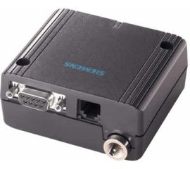
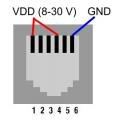

Title: Siemens MC35 GSM terminal hacking and programming
Tags: electronics
Date: 2007-12-13
Abstract: This article is a hack guide to the Siemens MC35 GSM terminal. Siemens MC35 is a common GSM/GPRS terminal that can provide embedded systems with GSM network connectivity.

This article is a hack guide to the Siemens MC35 GSM terminal. Siemens MC35 is a common GSM/GPRS terminal that can provide embedded systems with GSM network connectivity.
I bought one of this on an auction site at a deal price. Unfortunately I got no manuals, no instructions and no cables, just the bare terminal and the GSM antenna.

Power plug connector
--------------------
{.align-right .shadowed}
Powering it up is the first problem. The MC35 terminal has an uncommon RJ-11 like jack (formerly an RJ-12, I suppose) for power supply. I found a lot of power cables for sale on EBay but they have absolutely ridiculously high prices (it's not the money itself, but I can't manage to spend 30-40 EUR for a stupid cable) so I decided to make it by myself and write this guide.
After a few inspections, it turns out that only 3 of the 6 RJ-12 pins are connected on the PCB.

VDD: (8 to 30 V) Pin 1 and 4. GND: Pin 6

RJ-12 jacks are really difficult to be found on the market. RJ-11 jacks (i.e. phone jacks), on the other hand, are really common and cheap but lack the external pins 1 and 6 (they only have the four central pins). Hence, put the two things together and get the hack: just open the MC35 unit and short-circuit on the RJ-12 female connector pins 1 and 2 together and 5-6 together. As result of this you will be able to use a common RJ-11 jack and connect VDD to 1,3 pins (referred to 4 RJ-11 pinout) and GND to pin 4.
Please note that soldering on a SMD circuit is a very delicate process. Don't insist too much with your solder on the connector or the heat will melt and detach the plug itself (and nearby components).

Serial communication
--------------------
Communication with MC35 terminal is achieved with a standard RS-232 DB9 connector. The GSM will reply to standard AT command set plus a set of dedicated AT commands. You should easily find an AT reference manual for MC35 terminal. Here are the most common ones:

    

 -  Dialing a number: ATD012345;  
    (*Note the final " ; " Without final ; a data call will be initiated and the modem will put itself in data mode. If you provide a final ; a voice call will be available and the terminal will remain in command mode*)
 -  Answering a call: ATA
 -  Hanging-up a call: ATH
 -  Display product information: ATI
 -  Switch to PPP/Data mode: ATO
 -  Switch to Command mode: +++
 -  Read available operators: AT+COPS?
 -  Enter startup PIN: AT+CPIN=pin
 -  RSSI Signal quality: AT+CSQ (Reply value 0 to 99)
 -  Send an SMS: AT+CMGC=012345<CR>Message Text<CR>Ctrl+Z
 -  Shutdown: AT+SMSO
