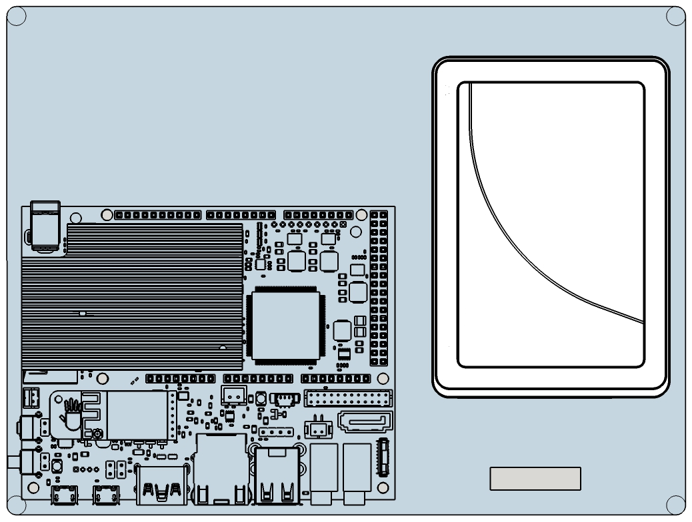

Title: My UDOO wall-mount set-top box
Tags: electronics
Date: 2015-02-09
Abstract: Pictures, video and cad model of my wall-mounted home-automation and set-top-box project based on a UDOO Quad board.

Pictures and a video of my home-automation and set-top-box project based on a UDOO Quad board.

See also [my blog article DIY Home Automation in the IoT era with UDOO and Polymer](/blog/diy-home-automation-with-udoo-and-polymer) for the realization details

Photos
------

Video
-----
<iframe src="https://www.youtube.com/embed/x9J6h4_e5PA" style="width:95%; height: 30em;" class="shadowed" allowfullscreen></iframe>

SketchUp Model
--------------
[{.inline} Download the SketchUp model](udoo-wall.zip)

